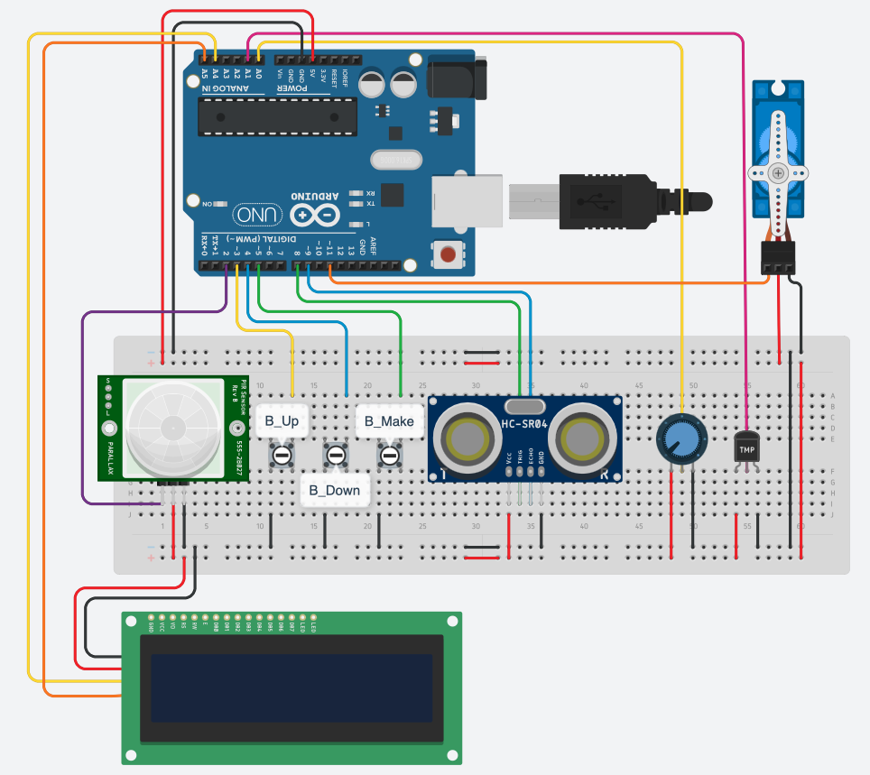

### Embdedded Systems and IoT - a.y. 21/22
# Assignment #2: Smart Coffee Machine Report

- [Assignment #2: Smart Coffee Machine Report](#assignment-2-smart-coffee-machine-report)
  - [Requirements](#requirements)
  - [Breadboard schema](#breadboard-schema)
  - [Design](#design)
    - [Main Task](#main-task)
    - [Dispensing Task](#dispensing-task)
    - [Self-Test Task](#self-test-task)
    - [Communication Task](#communication-task)

This is a short report explaining the modeling choices made during the development process of this Smart Coffee Machine.

## Requirements
All the requirements of the system can be found [here](requirements.pdf).

Below, a short video demonstrating the logic of the system:

**TODO**

## Breadboard schema
Below, the schematic of the circuit:



## Design
The focus of this section is on the design choices made along the development process to meet the requirements. 

The Arduino program has been conceived using a **tasks-based architecture** and **synchronous Finite State Machines**. For this purpose have been developed 4 different tasks, with different level of abstractions: a **Main Task**, a **Dispensing Task**, a **Self-Test Task** and a **Communication Task**.
These tasks communicates each other using a shared variable, called `state` for sake semplicity in the following schemas, which can assume 4 different values: 
```c
enum MachineState { 
    /** The machine is ready to start dispensing a new product */
    READY, 
    /** The machine is dispensing a new product */
    DISPENSING, 
    /** The machine in an assistance state. No products can be made */
    ASSISTANCE, 
    /** The machine is doing a self test */
    TESTING,
    /** The machine is sleeping */
    SLEEPING
};
```

### Main Task
This is the core task of the system. It deals with the buttons and potentiometer management, opportuntly triggering the dispensing process of a product. It manages also the sleep state and the assistance state of the system, during which the machine cannot dispense any kind of product.


According to some experiments, in order to not loose events, the period of this task has been set to 100ms: every 100ms the current state of this task is executed.

### Dispensing Task
This task takes care of the product dispensing process.


### Self-Test Task
This task every `T_check` makes a self test and, depending on the system state, set appropriately the state to `ASSISTANCE` or `READY`.


### Communication Task
This task has only one state, during which:
- send the machine infos through the Serial line in order to setting up the GUI on the Java Program;
- check if some message has been posted on the Serial Line by the Java Program (in order to resume the machine status).